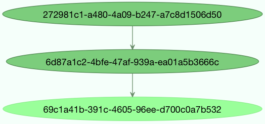

.. _guide-canvas:

==============================
 Canvas: Designing Work-flows
==============================

.. contents::
    :local:
    :depth: 2

.. _canvas-subtasks:

.. _canvas-signatures:

Signatures
==========

.. versionadded:: 2.0

You just learned how to call a task using the tasks ``delay`` method
in the :ref:`calling <guide-calling>` guide, and this is often all you need,
but sometimes you may want to pass the signature of a task invocation to
another process or as an argument to another function.

A :func:`~celery.signature` wraps the arguments, keyword arguments, and execution options
of a single task invocation in a way such that it can be passed to functions
or even serialized and sent across the wire.

- You can create a signature for the ``add`` task using its name like this:

    .. code-block:: pycon

        >>> from celery import signature
        >>> signature('tasks.add', args=(2, 2), countdown=10)
        tasks.add(2, 2)

  This task has a signature of arity 2 (two arguments): ``(2, 2)``,
  and sets the countdown execution option to 10.

- or you can create one using the task's ``signature`` method:

    .. code-block:: pycon

        >>> add.signature((2, 2), countdown=10)
        tasks.add(2, 2)

- There's also a shortcut using star arguments:

    .. code-block:: pycon

        >>> add.s(2, 2)
        tasks.add(2, 2)

- Keyword arguments are also supported:

    .. code-block:: pycon

        >>> add.s(2, 2, debug=True)
        tasks.add(2, 2, debug=True)

- From any signature instance you can inspect the different fields:

    .. code-block:: pycon

        >>> s = add.signature((2, 2), {'debug': True}, countdown=10)
        >>> s.args
        (2, 2)
        >>> s.kwargs
        {'debug': True}
        >>> s.options
        {'countdown': 10}

- It supports the "Calling API" of ``delay``,
  ``apply_async``, etc., including being called directly (``__call__``).

    Calling the signature will execute the task inline in the current process:

    .. code-block:: pycon

        >>> add(2, 2)
        4
        >>> add.s(2, 2)()
        4

    ``delay`` is our beloved shortcut to ``apply_async`` taking star-arguments:

    .. code-block:: pycon

        >>> result = add.delay(2, 2)
        >>> result.get()
        4

    ``apply_async`` takes the same arguments as the
    :meth:`Task.apply_async <@Task.apply_async>` method:

    .. code-block:: pycon

        >>> add.apply_async(args, kwargs, **options)
        >>> add.signature(args, kwargs, **options).apply_async()

        >>> add.apply_async((2, 2), countdown=1)
        >>> add.signature((2, 2), countdown=1).apply_async()

- You can't define options with :meth:`~@Task.s`, but a chaining
  ``set`` call takes care of that:

    .. code-block:: pycon

        >>> add.s(2, 2).set(countdown=1)
        proj.tasks.add(2, 2)

Partials
--------

With a signature, you can execute the task in a worker:

.. code-block:: pycon

    >>> add.s(2, 2).delay()
    >>> add.s(2, 2).apply_async(countdown=1)

Or you can call it directly in the current process:

.. code-block:: pycon

    >>> add.s(2, 2)()
    4

Specifying additional args, kwargs, or options to ``apply_async``/``delay``
creates partials:

- Any arguments added will be prepended to the args in the signature:

    .. code-block:: pycon

        >>> partial = add.s(2)          # incomplete signature
        >>> partial.delay(4)            # 4 + 2
        >>> partial.apply_async((4,))  # same

- Any keyword arguments added will be merged with the kwargs in the signature,
  with the new keyword arguments taking precedence:

    .. code-block:: pycon

        >>> s = add.s(2, 2)
        >>> s.delay(debug=True)                    # -> add(2, 2, debug=True)
        >>> s.apply_async(kwargs={'debug': True})  # same

- Any options added will be merged with the options in the signature,
  with the new options taking precedence:

    .. code-block:: pycon

        >>> s = add.signature((2, 2), countdown=10)
        >>> s.apply_async(countdown=1)  # countdown is now 1

You can also clone signatures to create derivatives:

.. code-block:: pycon

    >>> s = add.s(2)
    proj.tasks.add(2)

    >>> s.clone(args=(4,), kwargs={'debug': True})
    proj.tasks.add(4, 2, debug=True)

Immutability
------------

.. versionadded:: 3.0

Partials are meant to be used with callbacks, any tasks linked, or chord
callbacks will be applied with the result of the parent task.
Sometimes you want to specify a callback that doesn't take
additional arguments, and in that case you can set the signature
to be immutable:

.. code-block:: pycon

    >>> add.apply_async((2, 2), link=reset_buffers.signature(immutable=True))

The ``.si()`` shortcut can also be used to create immutable signatures:

.. code-block:: pycon

    >>> add.apply_async((2, 2), link=reset_buffers.si())

Only the execution options can be set when a signature is immutable,
so it's not possible to call the signature with partial args/kwargs.

.. note::

    In this tutorial I sometimes use the prefix operator `~` to signatures.
    You probably shouldn't use it in your production code, but it's a handy shortcut
    when experimenting in the Python shell:

    .. code-block:: pycon

        >>> ~sig

        >>> # is the same as
        >>> sig.delay().get()

.. _canvas-callbacks:

Callbacks
---------

.. versionadded:: 3.0

Callbacks can be added to any task using the ``link`` argument
to ``apply_async``:

.. code-block:: pycon

    add.apply_async((2, 2), link=other_task.s())

The callback will only be applied if the task exited successfully,
and it will be applied with the return value of the parent task as argument.

As I mentioned earlier, any arguments you add to a signature,
will be prepended to the arguments specified by the signature itself!

If you have the signature:

.. code-block:: pycon

    >>> sig = add.s(10)

then `sig.delay(result)` becomes:

.. code-block:: pycon

    >>> add.apply_async(args=(result, 10))

...

Now let's call our ``add`` task with a callback using partial
arguments:

.. code-block:: pycon

    >>> add.apply_async((2, 2), link=add.s(8))

As expected this will first launch one task calculating :math:`2 + 2`, then
another task calculating :math:`4 + 8`.

The Primitives
==============

.. versionadded:: 3.0

.. topic:: Overview

    - ``group``

        The group primitive is a signature that takes a list of tasks that should
        be applied in parallel.

    - ``chain``

        The chain primitive lets us link together signatures so that one is called
        after the other, essentially forming a *chain* of callbacks.

    - ``chord``

        A chord is just like a group but with a callback. A chord consists
        of a header group and a body,  where the body is a task that should execute
        after all of the tasks in the header are complete.

    - ``map``

        The map primitive works like the built-in ``map`` function, but creates
        a temporary task where a list of arguments is applied to the task.
        For example, ``task.map([1, 2])`` -- results in a single task
        being called, applying the arguments in order to the task function so
        that the result is:

        .. code-block:: python

            res = [task(1), task(2)]

    - ``starmap``

        Works exactly like map except the arguments are applied as ``*args``.
        For example ``add.starmap([(2, 2), (4, 4)])`` results in a single
        task calling:

        .. code-block:: python

            res = [add(2, 2), add(4, 4)]

    - ``chunks``

        Chunking splits a long list of arguments into parts, for example
        the operation:

        .. code-block:: pycon

            >>> items = zip(xrange(1000), xrange(1000))  # 1000 items
            >>> add.chunks(items, 10)

        will split the list of items into chunks of 10, resulting in 100
        tasks (each processing 10 items in sequence).

The primitives are also signature objects themselves, so that they can be combined
in any number of ways to compose complex work-flows.

Here's some examples:

- Simple chain

    Here's a simple chain, the first task executes passing its return value
    to the next task in the chain, and so on.

    .. code-block:: pycon

        >>> from celery import chain

        >>> # 2 + 2 + 4 + 8
        >>> res = chain(add.s(2, 2), add.s(4), add.s(8))()
        >>> res.get()
        16

    This can also be written using pipes:

    .. code-block:: pycon

        >>> (add.s(2, 2) | add.s(4) | add.s(8))().get()
        16

- Immutable signatures

    Signatures can be partial so arguments can be
    added to the existing arguments, but you may not always want that,
    for example if you don't want the result of the previous task in a chain.

    In that case you can mark the signature as immutable, so that the arguments
    cannot be changed:

    .. code-block:: pycon

        >>> add.signature((2, 2), immutable=True)

    There's also a ``.si()`` shortcut for this, and this is the preffered way of
    creating signatures:

    .. code-block:: pycon

        >>> add.si(2, 2)

    Now you can create a chain of independent tasks instead:

    .. code-block:: pycon

        >>> res = (add.si(2, 2) | add.si(4, 4) | add.si(8, 8))()
        >>> res.get()
        16

        >>> res.parent.get()
        8

        >>> res.parent.parent.get()
        4

- Simple group

    You can easily create a group of tasks to execute in parallel:

    .. code-block:: pycon

        >>> from celery import group
        >>> res = group(add.s(i, i) for i in xrange(10))()
        >>> res.get(timeout=1)
        [0, 2, 4, 6, 8, 10, 12, 14, 16, 18]

- Simple chord

    The chord primitive enables us to add a callback to be called when
    all of the tasks in a group have finished executing.  This is often
    required for algorithms that aren't *embarrassingly parallel*:

    .. code-block:: pycon

        >>> from celery import chord
        >>> res = chord((add.s(i, i) for i in xrange(10)), xsum.s())()
        >>> res.get()
        90

    The above example creates 10 task that all start in parallel,
    and when all of them are complete the return values are combined
    into a list and sent to the ``xsum`` task.

    The body of a chord can also be immutable, so that the return value
    of the group isn't passed on to the callback:

    .. code-block:: pycon

        >>> chord((import_contact.s(c) for c in contacts),
        ...       notify_complete.si(import_id)).apply_async()

    Note the use of ``.si`` above; this creates an immutable signature,
    meaning any new arguments passed (including to return value of the
    previous task) will be ignored.

- Blow your mind by combining

    Chains can be partial too:

    .. code-block:: pycon

        >>> c1 = (add.s(4) | mul.s(8))

        # (16 + 4) * 8
        >>> res = c1(16)
        >>> res.get()
        160

    this means that you can combine chains:

    .. code-block:: pycon

        # ((4 + 16) * 2 + 4) * 8
        >>> c2 = (add.s(4, 16) | mul.s(2) | (add.s(4) | mul.s(8)))

        >>> res = c2()
        >>> res.get()
        352

    Chaining a group together with another task will automatically
    upgrade it to be a chord:

    .. code-block:: pycon

        >>> c3 = (group(add.s(i, i) for i in xrange(10)) | xsum.s())
        >>> res = c3()
        >>> res.get()
        90

    Groups and chords accepts partial arguments too, so in a chain
    the return value of the previous task is forwarded to all tasks in the group:

    .. code-block:: pycon

        >>> new_user_workflow = (create_user.s() | group(
        ...                      import_contacts.s(),
        ...                      send_welcome_email.s()))
        ... new_user_workflow.delay(username='artv',
        ...                         first='Art',
        ...                         last='Vandelay',
        ...                         email='art@vandelay.com')

    If you don't want to forward arguments to the group then
    you can make the signatures in the group immutable:

    .. code-block:: pycon

        >>> res = (add.s(4, 4) | group(add.si(i, i) for i in xrange(10)))()
        >>> res.get()
        <GroupResult: de44df8c-821d-4c84-9a6a-44769c738f98 [
            bc01831b-9486-4e51-b046-480d7c9b78de,
            2650a1b8-32bf-4771-a645-b0a35dcc791b,
            dcbee2a5-e92d-4b03-b6eb-7aec60fd30cf,
            59f92e0a-23ea-41ce-9fad-8645a0e7759c,
            26e1e707-eccf-4bf4-bbd8-1e1729c3cce3,
            2d10a5f4-37f0-41b2-96ac-a973b1df024d,
            e13d3bdb-7ae3-4101-81a4-6f17ee21df2d,
            104b2be0-7b75-44eb-ac8e-f9220bdfa140,
            c5c551a5-0386-4973-aa37-b65cbeb2624b,
            83f72d71-4b71-428e-b604-6f16599a9f37]>

        >>> res.parent.get()
        8

.. _canvas-chain:

Chains
------

.. versionadded:: 3.0

Tasks can be linked together: the linked task is called when the task
returns successfully:

.. code-block:: pycon

    >>> res = add.apply_async((2, 2), link=mul.s(16))
    >>> res.get()
    64

The linked task will be applied with the result of its parent
task as the first argument. In the above case where the result was 64,
this will result in ``mul(4, 16)``.

The results will keep track of any subtasks called by the original task,
and this can be accessed from the result instance:

.. code-block:: pycon

    >>> res.children
    [<AsyncResult: 8c350acf-519d-4553-8a53-4ad3a5c5aeb4>]

    >>> res.children[0].get()
    64

The result instance also has a :meth:`~@AsyncResult.collect` method
that treats the result as a graph, enabling you to iterate over
the results:

.. code-block:: pycon

    >>> list(res.collect())
    [(<AsyncResult: 7b720856-dc5f-4415-9134-5c89def5664e>, 4),
     (<AsyncResult: 8c350acf-519d-4553-8a53-4ad3a5c5aeb4>, 64)]

By default :meth:`~@AsyncResult.collect` will raise an
:exc:`~@IncompleteStream` exception if the graph isn't fully
formed (one of the tasks hasn't completed yet),
but you can get an intermediate representation of the graph
too:

.. code-block:: pycon

    >>> for result, value in res.collect(intermediate=True)):
    ....

You can link together as many tasks as you like,
and signatures can be linked too:

.. code-block:: pycon

    >>> s = add.s(2, 2)
    >>> s.link(mul.s(4))
    >>> s.link(log_result.s())

You can also add *error callbacks* using the `on_error` method:

.. code-block:: pycon

    >>> add.s(2, 2).on_error(log_error.s()).delay()

This will result in the following ``.apply_async`` call when the signature
is applied:

.. code-block:: pycon

    >>> add.apply_async((2, 2), link_error=log_error.s())

The worker won't actually call the errback as a task, but will
instead call the errback function directly so that the raw request, exception
and traceback objects can be passed to it.

Here's an example errback:

.. code-block:: python

    from __future__ import print_function

    import os

    from proj.celery import app

    @app.task
    def log_error(request, exc, traceback):
        with open(os.path.join('/var/errors', request.id), 'a') as fh:
            print('--\n\n{0} {1} {2}'.format(
                task_id, exc, traceback), file=fh)

To make it even easier to link tasks together there's
a special signature called :class:`~celery.chain` that lets
you chain tasks together:

.. code-block:: pycon

    >>> from celery import chain
    >>> from proj.tasks import add, mul

    >>> # (4 + 4) * 8 * 10
    >>> res = chain(add.s(4, 4), mul.s(8), mul.s(10))
    proj.tasks.add(4, 4) | proj.tasks.mul(8) | proj.tasks.mul(10)

Calling the chain will call the tasks in the current process
and return the result of the last task in the chain:

.. code-block:: pycon

    >>> res = chain(add.s(4, 4), mul.s(8), mul.s(10))()
    >>> res.get()
    640

It also sets ``parent`` attributes so that you can
work your way up the chain to get intermediate results:

.. code-block:: pycon

    >>> res.parent.get()
    64

    >>> res.parent.parent.get()
    8

    >>> res.parent.parent
    <AsyncResult: eeaad925-6778-4ad1-88c8-b2a63d017933>

Chains can also be made using the ``|`` (pipe) operator:

.. code-block:: pycon

    >>> (add.s(2, 2) | mul.s(8) | mul.s(10)).apply_async()

Graphs
~~~~~~

In addition you can work with the result graph as a
:class:`~celery.utils.graph.DependencyGraph`:

.. code-block:: pycon

    >>> res = chain(add.s(4, 4), mul.s(8), mul.s(10))()

    >>> res.parent.parent.graph
    285fa253-fcf8-42ef-8b95-0078897e83e6(1)
        463afec2-5ed4-4036-b22d-ba067ec64f52(0)
    872c3995-6fa0-46ca-98c2-5a19155afcf0(2)
        285fa253-fcf8-42ef-8b95-0078897e83e6(1)
            463afec2-5ed4-4036-b22d-ba067ec64f52(0)

You can even convert these graphs to *dot* format:

.. code-block:: pycon

    >>> with open('graph.dot', 'w') as fh:
    ...     res.parent.parent.graph.to_dot(fh)

and create images:

.. code-block:: console

    $ dot -Tpng graph.dot -o graph.png

.. _canvas-group:

Groups
------

.. versionadded:: 3.0

A group can be used to execute several tasks in parallel.

The :class:`~celery.group` function takes a list of signatures:

.. code-block:: pycon

    >>> from celery import group
    >>> from proj.tasks import add

    >>> group(add.s(2, 2), add.s(4, 4))
    (proj.tasks.add(2, 2), proj.tasks.add(4, 4))

If you **call** the group, the tasks will be applied
one after another in the current process, and a :class:`~celery.result.GroupResult`
instance is returned that can be used to keep track of the results,
or tell how many tasks are ready and so on:

.. code-block:: pycon

    >>> g = group(add.s(2, 2), add.s(4, 4))
    >>> res = g()
    >>> res.get()
    [4, 8]

Group also supports iterators:

.. code-block:: pycon

    >>> group(add.s(i, i) for i in xrange(100))()

A group is a signature object, so it can be used in combination
with other signatures.

Group Results
~~~~~~~~~~~~~

The group task returns a special result too,
this result works just like normal task results, except
that it works on the group as a whole:

.. code-block:: pycon

    >>> from celery import group
    >>> from tasks import add

    >>> job = group([
    ...             add.s(2, 2),
    ...             add.s(4, 4),
    ...             add.s(8, 8),
    ...             add.s(16, 16),
    ...             add.s(32, 32),
    ... ])

    >>> result = job.apply_async()

    >>> result.ready()  # have all subtasks completed?
    True
    >>> result.successful() # were all subtasks successful?
    True
    >>> result.get()
    [4, 8, 16, 32, 64]

The :class:`~celery.result.GroupResult` takes a list of
:class:`~celery.result.AsyncResult` instances and operates on them as
if it was a single task.

It supports the following operations:

* :meth:`~celery.result.GroupResult.successful`

    Return :const:`True` if all of the subtasks finished
    successfully (e.g., didn't raise an exception).

* :meth:`~celery.result.GroupResult.failed`

    Return :const:`True` if any of the subtasks failed.

* :meth:`~celery.result.GroupResult.waiting`

    Return :const:`True` if any of the subtasks
    isn't ready yet.

* :meth:`~celery.result.GroupResult.ready`

    Return :const:`True` if all of the subtasks
    are ready.

* :meth:`~celery.result.GroupResult.completed_count`

    Return the number of completed subtasks.

* :meth:`~celery.result.GroupResult.revoke`

    Revoke all of the subtasks.

* :meth:`~celery.result.GroupResult.join`

    Gather the results of all subtasks
    and return them in the same order as they were called (as a list).

.. _canvas-chord:

Chords
------

.. versionadded:: 2.3

.. note::

    Tasks used within a chord must *not* ignore their results. If the result
    backend is disabled for *any* task (header or body) in your chord you
    should read ":ref:`chord-important-notes`." Chords are not currently
    supported with the RPC result backend.

A chord is a task that only executes after all of the tasks in a group have
finished executing.

Let's calculate the sum of the expression
:math:`1 + 1 + 2 + 2 + 3 + 3 ... n + n` up to a hundred digits.

First you need two tasks, :func:`add` and :func:`tsum` (:func:`sum` is
already a standard function):

.. code-block:: python

    @app.task
    def add(x, y):
        return x + y

    @app.task
    def tsum(numbers):
        return sum(numbers)

Now you can use a chord to calculate each addition step in parallel, and then
get the sum of the resulting numbers:

.. code-block:: pycon

    >>> from celery import chord
    >>> from tasks import add, tsum

    >>> chord(add.s(i, i)
    ...       for i in xrange(100))(tsum.s()).get()
    9900

This is obviously a very contrived example, the overhead of messaging and
synchronization makes this a lot slower than its Python counterpart:

.. code-block:: pycon

    >>> sum(i + i for i in xrange(100))

The synchronization step is costly, so you should avoid using chords as much
as possible. Still, the chord is a powerful primitive to have in your toolbox
as synchronization is a required step for many parallel algorithms.

Let's break the chord expression down:

.. code-block:: pycon

    >>> callback = tsum.s()
    >>> header = [add.s(i, i) for i in range(100)]
    >>> result = chord(header)(callback)
    >>> result.get()
    9900

Remember, the callback can only be executed after all of the tasks in the
header have returned. Each step in the header is executed as a task, in
parallel, possibly on different nodes. The callback is then applied with
the return value of each task in the header. The task id returned by
:meth:`chord` is the id of the callback, so you can wait for it to complete
and get the final return value (but remember to :ref:`never have a task wait
for other tasks <task-synchronous-subtasks>`)

.. _chord-errors:

Error handling
~~~~~~~~~~~~~~

So what happens if one of the tasks raises an exception?

The chord callback result will transition to the failure state, and the error is set
to the :exc:`~@ChordError` exception:

.. code-block:: pycon

    >>> c = chord([add.s(4, 4), raising_task.s(), add.s(8, 8)])
    >>> result = c()
    >>> result.get()

.. code-block:: pytb

    Traceback (most recent call last):
      File "<stdin>", line 1, in <module>
      File "*/celery/result.py", line 120, in get
        interval=interval)
      File "*/celery/backends/amqp.py", line 150, in wait_for
        raise meta['result']
    celery.exceptions.ChordError: Dependency 97de6f3f-ea67-4517-a21c-d867c61fcb47
        raised ValueError('something something',)

While the traceback may be different depending on the result backend used,
you can see that the error description includes the id of the task that failed
and a string representation of the original exception. You can also
find the original traceback in ``result.traceback``.

Note that the rest of the tasks will still execute, so the third task
(``add.s(8, 8)``) is still executed even though the middle task failed.
Also the :exc:`~@ChordError` only shows the task that failed
first (in time): it doesn't respect the ordering of the header group.

To perform an action when a chord fails you can therefore attach
an errback to the chord callback:

.. code-block:: python

    @app.task
    def on_chord_error(request, exc, traceback):
        print('Task {0!r} raised error: {1!r}'.format(request.id, exc))

.. code-block:: pycon

    >>> c = (group(add.s(i, i) for i in range(10)) |
    ...      xsum.s().on_error(on_chord_error.s())).delay()

.. _chord-important-notes:

Important Notes
~~~~~~~~~~~~~~~

Tasks used within a chord must *not* ignore their results. In practice this
means that you must enable a :const:`result_backend` in order to use
chords. Additionally, if :const:`task_ignore_result` is set to :const:`True`
in your configuration, be sure that the individual tasks to be used within
the chord are defined with :const:`ignore_result=False`. This applies to both
Task subclasses and decorated tasks.

Example Task subclass:

.. code-block:: python

    class MyTask(Task):
        ignore_result = False

Example decorated task:

.. code-block:: python

    @app.task(ignore_result=False)
    def another_task(project):
        do_something()

By default the synchronization step is implemented by having a recurring task
poll the completion of the group every second, calling the signature when
ready.

Example implementation:

.. code-block:: python

    from celery import maybe_signature

    @app.task(bind=True)
    def unlock_chord(self, group, callback, interval=1, max_retries=None):
        if group.ready():
            return maybe_signature(callback).delay(group.join())
        raise self.retry(countdown=interval, max_retries=max_retries)

This is used by all result backends except Redis and Memcached: they
increment a counter after each task in the header, then applies the callback
when the counter exceeds the number of tasks in the set.

The Redis and Memcached approach is a much better solution, but not easily
implemented in other backends (suggestions welcome!).

.. note::

   Chords don't properly work with Redis before version 2.2; you'll need to
   upgrade to at least redis-server 2.2 to use them.

.. note::

    If you're using chords with the Redis result backend and also overriding
    the :meth:`Task.after_return` method, you need to make sure to call the
    super method or else the chord callback won't be applied.

    .. code-block:: python

        def after_return(self, *args, **kwargs):
            do_something()
            super(MyTask, self).after_return(*args, **kwargs)

.. _canvas-map:

Map & Starmap
-------------

:class:`~celery.map` and :class:`~celery.starmap` are built-in tasks
that calls the task for every element in a sequence.

They differ from group in that

- only one task message is sent

- the operation is sequential.

For example using ``map``:

.. code-block:: pycon

    >>> from proj.tasks import add

    >>> ~xsum.map([range(10), range(100)])
    [45, 4950]

is the same as having a task doing:

.. code-block:: python

    @app.task
    def temp():
        return [xsum(range(10)), xsum(range(100))]

and using ``starmap``:

.. code-block:: pycon

    >>> ~add.starmap(zip(range(10), range(10)))
    [0, 2, 4, 6, 8, 10, 12, 14, 16, 18]

is the same as having a task doing:

.. code-block:: python

    @app.task
    def temp():
        return [add(i, i) for i in range(10)]

Both ``map`` and ``starmap`` are signature objects, so they can be used as
other signatures and combined in groups etc., for example
to call the starmap after 10 seconds:

.. code-block:: pycon

    >>> add.starmap(zip(range(10), range(10))).apply_async(countdown=10)

.. _canvas-chunks:

Chunks
------

Chunking lets you divide an iterable of work into pieces, so that if
you have one million objects, you can create 10 tasks with hundred
thousand objects each.

Some may worry that chunking your tasks results in a degradation
of parallelism, but this is rarely true for a busy cluster
and in practice since you're avoiding the overhead  of messaging
it may considerably increase performance.

To create a chunks signature you can use :meth:`@Task.chunks`:

.. code-block:: pycon

    >>> add.chunks(zip(range(100), range(100)), 10)

As with :class:`~celery.group` the act of sending the messages for
the chunks will happen in the current process when called:

.. code-block:: pycon

    >>> from proj.tasks import add

    >>> res = add.chunks(zip(range(100), range(100)), 10)()
    >>> res.get()
    [[0, 2, 4, 6, 8, 10, 12, 14, 16, 18],
     [20, 22, 24, 26, 28, 30, 32, 34, 36, 38],
     [40, 42, 44, 46, 48, 50, 52, 54, 56, 58],
     [60, 62, 64, 66, 68, 70, 72, 74, 76, 78],
     [80, 82, 84, 86, 88, 90, 92, 94, 96, 98],
     [100, 102, 104, 106, 108, 110, 112, 114, 116, 118],
     [120, 122, 124, 126, 128, 130, 132, 134, 136, 138],
     [140, 142, 144, 146, 148, 150, 152, 154, 156, 158],
     [160, 162, 164, 166, 168, 170, 172, 174, 176, 178],
     [180, 182, 184, 186, 188, 190, 192, 194, 196, 198]]

while calling ``.apply_async`` will create a dedicated
task so that the individual tasks are applied in a worker
instead:

.. code-block:: pycon

    >>> add.chunks(zip(range(100), range(100)), 10).apply_async()

You can also convert chunks to a group:

.. code-block:: pycon

    >>> group = add.chunks(zip(range(100), range(100)), 10).group()

and with the group skew the countdown of each task by increments
of one:

.. code-block:: pycon

    >>> group.skew(start=1, stop=10)()

This means that the first task will have a countdown of one second, the second
task a countdown of two seconds, and so on.
