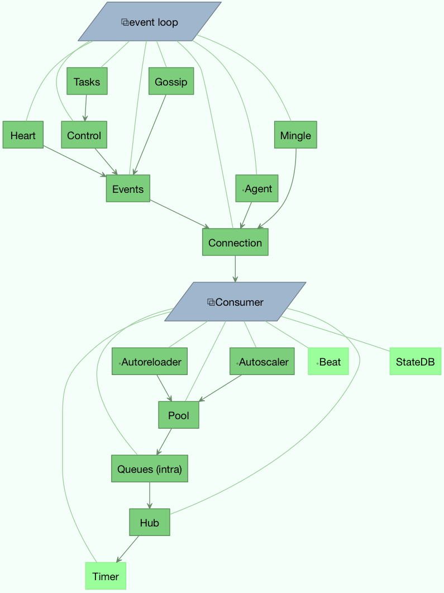

.. _guide-extending:

==========================
 Extensions and Bootsteps
==========================

.. contents::
    :local:
    :depth: 2

.. _extending-custom-consumers:

Custom Message Consumers
========================

You may want to embed custom Kombu consumers to manually process your messages.

For that purpose a special :class:`~celery.bootstep.ConsumerStep` bootstep class
exists, where you only need to define the ``get_consumers`` method, which must
return a list of :class:`kombu.Consumer` objects to start
whenever the connection is established:

.. code-block:: python

    from celery import Celery
    from celery import bootsteps
    from kombu import Consumer, Exchange, Queue

    my_queue = Queue('custom', Exchange('custom'), 'routing_key')

    app = Celery(broker='amqp://')

    class MyConsumerStep(bootsteps.ConsumerStep):

        def get_consumers(self, channel):
            return [Consumer(channel,
                             queues=[my_queue],
                             callbacks=[self.handle_message],
                             accept=['json'])]

        def handle_message(self, body, message):
            print('Received message: {0!r}'.format(body))
            message.ack()
    app.steps['consumer'].add(MyConsumerStep)

    def send_me_a_message(self, who='world!', producer=None):
        with app.producer_or_acquire(producer) as producer:
            producer.send(
                {'hello': who},
                serializer='json',
                exchange=my_queue.exchange,
                routing_key='routing_key',
                declare=[my_queue],
                retry=True,
            )

    if __name__ == '__main__':
        send_me_a_message('celery')

.. note::

    Kombu Consumers can take use of two different message callback dispatching
    mechanisms.  The first one is the ``callbacks`` argument which accepts
    a list of callbacks with a ``(body, message)`` signature,
    the second one is the ``on_message`` argument which takes a single
    callback with a ``(message, )`` signature.  The latter will not
    automatically decode and deserialize the payload which is useful
    in many cases:

    .. code-block:: python

        def get_consumers(self, channel):
            return [Consumer(channel, queues=[my_queue],
                             on_message=self.on_message)]

        def on_message(self, message):
            payload = message.decode()
            print(
                'Received message: {0!r} {props!r} rawlen={s}'.format(
                payload, props=message.properties, s=len(message.body),
            ))
            message.ack()

.. _extending-blueprints:

Blueprints
==========

Bootsteps is a technique to add functionality to the workers.
A bootstep is a custom class that defines hooks to do custom actions
at different stages in the worker.   Every bootstep belongs to a blueprint,
and the worker currently defines two blueprints: **Worker**, and **Consumer**

----------------------------------------------------------

**Figure A:** Bootsteps in the Worker and Consumer blueprints.  Starting
              from the bottom up the first step in the worker blueprint
              is the Timer, and the last step is to start the Consumer blueprint,
              which then establishes the broker connection and starts
              consuming messages.

----------------------------------------------------------

Worker
======

The Worker is the first blueprint to start, and with it starts major components like
the event loop, processing pool, the timer, and also optional components
like the autoscaler.  When the worker is fully started it will continue
to the Consumer blueprint.

The :class:`~celery.worker.WorkController` is the core worker implementation,
and contains several methods and attributes that you can use in your bootstep.

Attributes
----------

.. attribute:: app

    The current app instance.

.. attribute:: hostname

    The workers node name (e.g. `worker1@example.com`)

.. attribute:: blueprint

    This is the worker :class:`~celery.bootsteps.Blueprint`.

.. attribute:: hub

    Event loop object (:class:`~kombu.async.Hub`).  You can use
    this to register callbacks in the event loop.

    This is only supported by async I/O enabled transports (amqp, redis),
    in which case the `worker.use_eventloop` attribute should be set.

    Your bootstep must require the Hub bootstep to use this.

.. attribute:: pool

    The current process/eventlet/gevent/thread pool.
    See :class:`celery.concurrency.base.BasePool`.

    Your bootstep must require the Pool bootstep to use this.

.. attribute:: timer

    :class:`~kombu.async.timer.Timer` used to schedule functions.

    Your bootstep must require the Timer bootstep to use this.

.. attribute:: statedb

    :class:`Database <celery.worker.state.Persistent>`` to persist state between
    worker restarts.

    This only exists if the ``statedb`` argument is enabled.
    Your bootstep must require the Statedb bootstep to use this.

.. attribute:: autoscaler

    :class:`~celery.worker.autoscaler.Autoscaler` used to automatically grow
    and shrink the number of processes in the pool.

    This only exists if the ``autoscale`` argument is enabled.
    Your bootstep must require the Autoscaler bootstep to use this.

.. attribute:: autoreloader

    :class:`~celery.worker.autoreloder.Autoreloader` used to automatically
    reload use code when the filesystem changes.

    This only exists if the ``autoreload`` argument is enabled.
    Your bootstep must require the Autoreloader bootstep to use this.

An example Worker bootstep could be:

.. code-block:: python

    from celery import bootsteps

    class ExampleWorkerStep(bootsteps.StartStopStep):
        requires = ('Pool', )

        def __init__(self, worker, **kwargs):
            print('Called when the WorkController instance is constructed')
            print('Arguments to WorkController: {0!r}'.format(kwargs))

        def create(self, worker):
            # this method can be used to delegate the action methods
            # to another object that implements ``start`` and ``stop``.
            return self

        def start(self, worker):
            print('Called when the worker is started.')

        def stop(self, worker):
            print("Called when the worker shuts down.")

        def terminate(self, worker):
            print("Called when the worker terminates")

Every method is passed the current ``WorkController`` instance as the first
argument.

Another example could use the timer to wake up at regular intervals:

.. code-block:: python

    from celery import bootsteps

    class DeadlockDetection(bootsteps.StartStopStep):
        requires = ('Timer', )

        def __init__(self, worker, deadlock_timeout=3600):
            self.timeout = deadlock_timeout
            self.requests = []
            self.tref = None

        def start(self, worker):
            # run every 30 seconds.
            self.tref = worker.timer.call_repeatedly(
                30.0, self.detect, (worker, ), priority=10,
            )

        def stop(self, worker):
            if self.tref:
                self.tref.cancel()
                self.tref = None

        def detect(self, worker):
            # update active requests
            for req in self.worker.active_requests:
                if req.time_start and time() - req.time_start > self.timeout:
                    raise SystemExit()

Consumer
========

The Consumer blueprint establishes a connection to the broker, and
is restarted every time this connection is lost.   Consumer bootsteps
include the worker heartbeat, the remote control command consumer, and
importantly, the task consumer.

When you create consumer bootsteps you must take into account that it must
be possible to restart your blueprint.  An additional 'shutdown' method is
defined for consumer bootsteps, this method is called when the worker is
shutdown.

Attributes
----------

.. attribute:: app

    The current app instance.

.. attribute:: controller

    The parent :class:`~@WorkController` object that created this consumer.

.. attribute:: hostname

    The workers node name (e.g. `worker1@example.com`)

.. attribute:: blueprint

    This is the worker :class:`~celery.bootsteps.Blueprint`.

.. attribute:: hub

    Event loop object (:class:`~kombu.async.Hub`).  You can use
    this to register callbacks in the event loop.

    This is only supported by async I/O enabled transports (amqp, redis),
    in which case the `worker.use_eventloop` attribute should be set.

    Your bootstep must require the Hub bootstep to use this.

.. attribute:: connection

    The current broker connection (:class:`kombu.Connection`).

    Your bootstep must require the 'Connection' bootstep to use this.

.. attribute:: event_dispatcher

    A :class:`@events.Dispatcher` object that can be used to send events.

    Your bootstep must require the `Events` bootstep to use this.

.. attribute:: gossip

    Worker to worker broadcast communication
    (class:`~celery.worker.consumer.Gossip`).

.. attribute:: pool

    The current process/eventlet/gevent/thread pool.
    See :class:`celery.concurrency.base.BasePool`.

.. attribute:: timer

    :class:`Timer <celery.utils.timer2.Schedule` used to schedule functions.

.. attribute:: heart

    Responsible for sending worker event heartbeats
    (:class:`~celery.worker.heartbeat.Heart`).

    Your bootstep must require the `Heart` bootstep to use this.

.. attribute:: task_consumer

    The :class:`kombu.Consumer` object used to consume task messages.

    Your bootstep must require the `Tasks` bootstep to use this.

.. attribute:: strategies

    Every registered task type has an entry in this mapping,
    where the value is used to execute an incoming message of this task type
    (the task execution strategy).  This mapping is generated by the Tasks
    bootstep when the consumer starts::

        for name, task in app.tasks.items():
            strategies[name] = task.start_strategy(app, consumer)
            task.__trace__ = celery.app.trace.build_tracer(
                name, task, loader, hostname
            )

    Your bootstep must require the `Tasks` bootstep to use this.

.. attribute:: task_buckets

    A :class:`~collections.defaultdict` used to lookup the rate limit for
    a task by type.
    Entries in this dict may be None (for no limit) or a
    :class:`~kombu.utils.limits.TokenBucket` instance implementing
    ``consume(tokens)`` and ``expected_time(tokens)``.

    TokenBucket implements the `token bucket algorithm`_, but any algorithm
    may be used as long as it conforms to the same interface and defines the
    two methods above.

    .. _`token bucket algorithm`: http://en.wikipedia.org/wiki/Token_bucket

.. attribute:: qos

    The :class:`~kombu.common.QoS` object can be used to change the
    task channels current prefetch_count value, e.g::

        # increment at next cycle
        consumer.qos.increment_eventually(1)
        # decrement at next cycle
        consumer.qos.decrement_eventually(1)
        consumer.qos.set(10)

Methods
-------

.. method:: consumer.reset_rate_limits()

    Updates the ``task_buckets`` mapping for all registered task types.

.. method:: consumer.bucket_for_task(type, Bucket=TokenBucket)

    Creates rate limit bucket for a task using its ``task.rate_limit``
    attribute.

.. method:: consumer.add_task_queue(name, exchange=None, exchange_type=None,
                                    routing_key=None, \*\*options):

    Adds new queue to consume from.  This will persist on connection restart.

.. method:: consumer.cancel_task_queue(name)

    Stop consuming from queue by name.  This will persist on connection
    restart.

.. method:: apply_eta_task(request)

    Schedule eta task to execute based on the ``request.eta`` attribute.
    (:class:`~celery.worker.job.Request`)

.. _extending-bootsteps:

Installing Bootsteps
====================

``app.steps['worker']`` and ``app.steps['consumer']`` can be modified
to add new bootsteps::

    >>> app = Celery()
    >>> app.steps['worker'].add(MyWorkerStep)  # < add class, do not instantiate
    >>> app.steps['consumer'].add(MyConsumerStep)

    >>> app.steps['consumer'].update([StepA, StepB])

    >>> app.steps['consumer']
    {step:proj.StepB{()}, step:proj.MyConsumerStep{()}, step:proj.StepA{()}

The order of steps is not important here as the order is decided by the
resulting dependency graph (``Step.requires``).

To illustrate how you can install bootsteps and how they work, this is an example step that
prints some useless debugging information.
It can be added both as a worker and consumer bootstep:

.. code-block:: python

    from celery import Celery
    from celery import bootsteps

    class InfoStep(bootsteps.Step):

        def __init__(self, parent, **kwargs):
            # here we can prepare the Worker/Consumer object
            # in any way we want, set attribute defaults and so on.
            print('{0!r} is in init'.format(parent))

        def start(self, parent):
            # our step is started together with all other Worker/Consumer
            # bootsteps.
            print('{0!r} is starting'.format(parent))

        def stop(self, parent):
            # the Consumer calls stop every time the consumer is restarted
            # (i.e. connection is lost) and also at shutdown.  The Worker
            # will call stop at shutdown only.
            print('{0!r} is stopping'.format(parent))

        def shutdown(self, parent):
            # shutdown is called by the Consumer at shutdown, it's not
            # called by Worker.
            print('{0!r} is shutting down'.format(parent))

        app = Celery(broker='amqp://')
        app.steps['worker'].add(InfoStep)
        app.steps['consumer'].add(InfoStep)

Starting the worker with this step installed will give us the following
logs::

    <Worker: w@example.com (initializing)> is in init
    <Consumer: w@example.com (initializing)> is in init
    [2013-05-29 16:18:20,544: WARNING/MainProcess]
        <Worker: w@example.com (running)> is starting
    [2013-05-29 16:18:21,577: WARNING/MainProcess]
        <Consumer: w@example.com (running)> is starting
    <Consumer: w@example.com (closing)> is stopping
    <Worker: w@example.com (closing)> is stopping
    <Consumer: w@example.com (terminating)> is shutting down

The ``print`` statements will be redirected to the logging subsystem after
the worker has been initialized, so the "is starting" lines are timestamped.
You may notice that this does no longer happen at shutdown, this is because
the ``stop`` and ``shutdown`` methods are called inside a *signal handler*,
and it's not safe to use logging inside such a handler.
Logging with the Python logging module is not :term:`reentrant`,
which means that you cannot interrupt the function and
call it again later.  It's important that the ``stop`` and ``shutdown`` methods
you write is also :term:`reentrant`.

Starting the worker with ``--loglevel=debug`` will show us more
information about the boot process::

    [2013-05-29 16:18:20,509: DEBUG/MainProcess] | Worker: Preparing bootsteps.
    [2013-05-29 16:18:20,511: DEBUG/MainProcess] | Worker: Building graph...
    <celery.apps.worker.Worker object at 0x101ad8410> is in init
    [2013-05-29 16:18:20,511: DEBUG/MainProcess] | Worker: New boot order:
        {Hub, Queues (intra), Pool, Autoreloader, Timer, StateDB,
         Autoscaler, InfoStep, Beat, Consumer}
    [2013-05-29 16:18:20,514: DEBUG/MainProcess] | Consumer: Preparing bootsteps.
    [2013-05-29 16:18:20,514: DEBUG/MainProcess] | Consumer: Building graph...
    <celery.worker.consumer.Consumer object at 0x101c2d8d0> is in init
    [2013-05-29 16:18:20,515: DEBUG/MainProcess] | Consumer: New boot order:
        {Connection, Mingle, Events, Gossip, InfoStep, Agent,
         Heart, Control, Tasks, event loop}
    [2013-05-29 16:18:20,522: DEBUG/MainProcess] | Worker: Starting Hub
    [2013-05-29 16:18:20,522: DEBUG/MainProcess] ^-- substep ok
    [2013-05-29 16:18:20,522: DEBUG/MainProcess] | Worker: Starting Pool
    [2013-05-29 16:18:20,542: DEBUG/MainProcess] ^-- substep ok
    [2013-05-29 16:18:20,543: DEBUG/MainProcess] | Worker: Starting InfoStep
    [2013-05-29 16:18:20,544: WARNING/MainProcess]
        <celery.apps.worker.Worker object at 0x101ad8410> is starting
    [2013-05-29 16:18:20,544: DEBUG/MainProcess] ^-- substep ok
    [2013-05-29 16:18:20,544: DEBUG/MainProcess] | Worker: Starting Consumer
    [2013-05-29 16:18:20,544: DEBUG/MainProcess] | Consumer: Starting Connection
    [2013-05-29 16:18:20,559: INFO/MainProcess] Connected to amqp://guest@127.0.0.1:5672//
    [2013-05-29 16:18:20,560: DEBUG/MainProcess] ^-- substep ok
    [2013-05-29 16:18:20,560: DEBUG/MainProcess] | Consumer: Starting Mingle
    [2013-05-29 16:18:20,560: INFO/MainProcess] mingle: searching for neighbors
    [2013-05-29 16:18:21,570: INFO/MainProcess] mingle: no one here
    [2013-05-29 16:18:21,570: DEBUG/MainProcess] ^-- substep ok
    [2013-05-29 16:18:21,571: DEBUG/MainProcess] | Consumer: Starting Events
    [2013-05-29 16:18:21,572: DEBUG/MainProcess] ^-- substep ok
    [2013-05-29 16:18:21,572: DEBUG/MainProcess] | Consumer: Starting Gossip
    [2013-05-29 16:18:21,577: DEBUG/MainProcess] ^-- substep ok
    [2013-05-29 16:18:21,577: DEBUG/MainProcess] | Consumer: Starting InfoStep
    [2013-05-29 16:18:21,577: WARNING/MainProcess]
        <celery.worker.consumer.Consumer object at 0x101c2d8d0> is starting
    [2013-05-29 16:18:21,578: DEBUG/MainProcess] ^-- substep ok
    [2013-05-29 16:18:21,578: DEBUG/MainProcess] | Consumer: Starting Heart
    [2013-05-29 16:18:21,579: DEBUG/MainProcess] ^-- substep ok
    [2013-05-29 16:18:21,579: DEBUG/MainProcess] | Consumer: Starting Control
    [2013-05-29 16:18:21,583: DEBUG/MainProcess] ^-- substep ok
    [2013-05-29 16:18:21,583: DEBUG/MainProcess] | Consumer: Starting Tasks
    [2013-05-29 16:18:21,606: DEBUG/MainProcess] basic.qos: prefetch_count->80
    [2013-05-29 16:18:21,606: DEBUG/MainProcess] ^-- substep ok
    [2013-05-29 16:18:21,606: DEBUG/MainProcess] | Consumer: Starting event loop
    [2013-05-29 16:18:21,608: WARNING/MainProcess] celery@example.com ready.

.. _extending-programs:

Command-line programs
=====================

.. _extending-commandoptions:

Adding new command-line options
-------------------------------

You can add additional command-line options to the ``worker``, ``beat`` and
``events`` commands by modifying the :attr:`~@Celery.user_options` attribute of the
application instance.

Celery commands uses the :mod:`optparse` module to parse command-line
arguments, and so you have to use optparse specific option instances created
using :func:`optparse.make_option`.  Please see the :mod:`optparse`
documentation to read about the fields supported.

Example adding a custom option to the :program:`celery worker` command:

.. code-block:: python

    from celery import Celery
    from celery.bin import Option

    app = Celery(broker='amqp://')

    app.user_options['worker'].add(
        Option('--enable-my-option', action='store_true', default=False,
               help='Enable custom option.'),
    )

.. _extending-subcommands:

Adding new :program:`celery` sub-commands
-----------------------------------------

New commands can be added to the :program:`celery` umbrella command by using
`setuptools entry-points`_.

.. _`setuptools entry-points`:
    http://reinout.vanrees.org/weblog/2010/01/06/zest-releaser-entry-points.html

Entry-points is special metadata that can be added to your packages ``setup.py`` program,
and then after installation, read from the system using the :mod:`pkg_resources` module.

Celery recognizes ``celery.commands`` entry-points to install additional
subcommands, where the value of the entry-point must point to a valid subclass
of :class:`celery.bin.base.Command`.  Sadly there is limited documentation,
but you can find inspiration from the various commands in the
:mod:`celery.bin` package.

This is how the Flower_ monitoring extension adds the :program:`celery flower` command,
by adding an entry-point in :file:`setup.py`:

.. code-block:: python

    setup(
        name='flower',
        entry_points={
            'celery.commands': [
               'flower = flower.command.FlowerCommand',
            ],
        }
    )

.. _Flower: http://pypi.python.org/pypi/flower

The command definition is in two parts separated by the equal sign, where the
first part is the name of the subcommand (flower), then the fully qualified
module path to the class that implements the command
(``flower.command.FlowerCommand``).

In the module :file:`flower/command.py`, the command class is defined
something like this:

.. code-block:: python

    from celery.bin.base import Command, Option

    class FlowerCommand(Command):

        def get_options(self):
            return (
                Option('--port', default=8888, type='int',
                    help='Webserver port',
                ),
                Option('--debug', action='store_true'),
            )

        def run(self, port=None, debug=False, **kwargs):
            print('Running our command')

Worker API
==========

:class:`~kombu.async.Hub` - The workers async event loop.
---------------------------------------------------------
:supported transports: amqp, redis

.. versionadded:: 3.0

The worker uses asynchronous I/O when the amqp or redis broker transports are
used.  The eventual goal is for all transports to use the eventloop, but that
will take some time so other transports still use a threading-based solution.

.. method:: hub.add(fd, callback, flags)

.. method:: hub.add_reader(fd, callback, \*args)

    Add callback to be called when ``fd`` is readable.

    The callback will stay registered until explictly removed using
    :meth:`hub.remove(fd) <hub.remove>`, or the fd is automatically discarded
    because it's no longer valid.

    Note that only one callback can be registered for any given fd at a time,
    so calling ``add`` a second time will remove any callback that
    was previously registered for that fd.

    A file descriptor is any file-like object that supports the ``fileno``
    method, or it can be the file descriptor number (int).

.. method:: hub.add_writer(fd, callback, \*args)

    Add callback to be called when ``fd`` is writable.
    See also notes for :meth:`hub.add_reader` above.

.. method:: hub.remove(fd)

    Remove all callbacks for ``fd`` from the loop.

Timer - Scheduling events
-------------------------

.. method:: timer.call_after(secs, callback, args=(), kwargs=(),
                             priority=0)

.. method:: timer.call_repeatedly(secs, callback, args=(), kwargs=(),
                                  priority=0)

.. method:: timer.call_at(eta, callback, args=(), kwargs=(),
                          priority=0)
