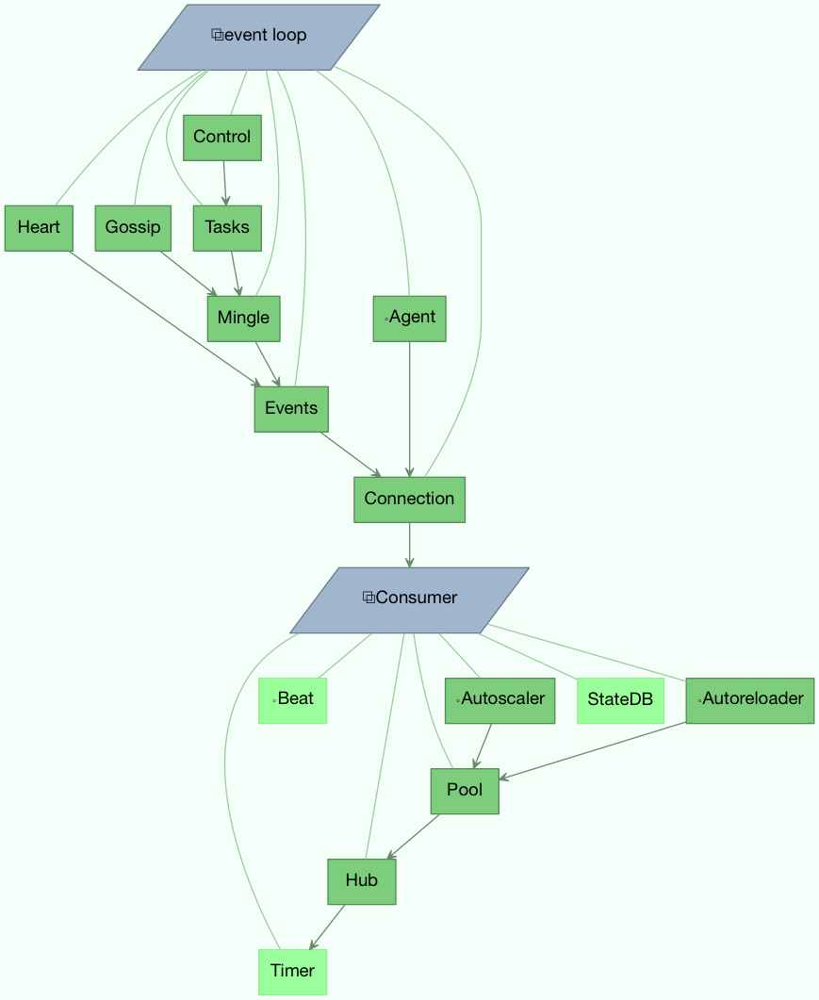

.. _guide-extending:

==========================
 Extensions and Bootsteps
==========================

.. contents::
    :local:
    :depth: 2

.. _extending-bootsteps:

Bootsteps
=========

.. _extending-worker-bootsteps:

Worker Bootsteps
================

.. figure:: ../images/worker_graph.png
   :width: 700px

Consumer Bootsteps
==================

.. figure:: ../images/consumer_graph.png
   :width: 700px

.. _extending-programs:

Command-line programs
=====================

.. _extending-commandoptions:

Adding new command-line options
-------------------------------

You can add additional command-line options to the ``worker``, ``beat`` and
``events`` commands by modifying the :attr:`~@Celery.user_options` attribute of the
application instance.

Celery commands uses the :mod:`optparse` module to parse command-line
arguments, and so you have to use optparse specific option instances created
using :func:`optparse.make_option`.  Please see the :mod:`optparse`
documentation to read about the fields supported.

Example adding a custom option to the :program:`celery worker` command:

.. code-block:: python

    from celery import Celery
    from optparse import make_option as Option

    celery = Celery(broker='amqp://')

    celery.user_options['worker'].add(
        Option('--enable-my-option', action='store_true', default=False,
               help='Enable custom option.'),
    )

.. _extending-subcommands:

Adding new :program:`celery` sub-commands
-----------------------------------------

New commands can be added to the :program:`celery` umbrella command by using
`setuptools entry-points`_.

.. _`setuptools entry-points`:
    http://reinout.vanrees.org/weblog/2010/01/06/zest-releaser-entry-points.html

Entry-points is special metadata that can be added to your packages ``setup.py`` program,
and then after installation, read from the system using the :mod:`pkg_resources` module.

Celery recognizes ``celery.commands`` entry-points to install additional
subcommands, where the value of the entry-point must point to a valid subclass
of :class:`celery.bin.base.Command`.  Sadly there is limited documentation,
but you can find inspiration from the various commands in the
:mod:`celery.bin` package.

This is how the Flower_ monitoring extension adds the :program:`celery flower` command,
by adding an entry-point in :file:`setup.py`:

.. code-block:: python

    setup(
        name='flower',
        entry_points={
            'celery.commands': [
               'flower = flower.command.FlowerCommand',
            ],
        }
    )

.. _Flower: http://pypi.python.org/pypi/flower

The command definition is in two parts separated by the equal sign, where the
first part is the name of the subcommand (flower), then the fully qualified
module path to the class that implements the command
(``flower.command.FlowerCommand``).

In the module :file:`flower/command.py`, the command class is defined
something like this:

.. code-block:: python

    from celery.bin.base import Command, Option

    class FlowerCommand(Command):

        def get_options(self):
            return (
                Option('--port', default=8888, type='int',
                    help='Webserver port',
                ),
                Option('--debug', action='store_true'),
            )

        def run(self, port=None, debug=False, **kwargs):
            print('Running our command')
