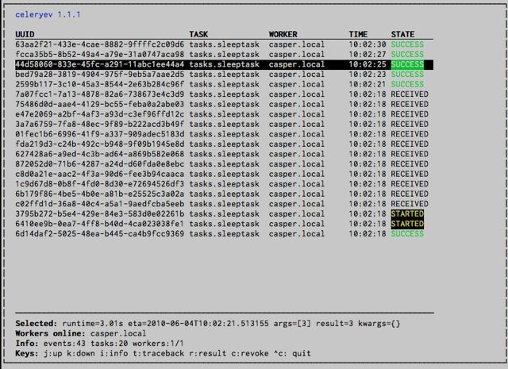

.. _guide-monitoring:

=================================
 Monitoring and Management Guide
=================================

.. contents::
    :local:

Introduction
============

There are several tools available to monitor and inspect Celery clusters.

This document describes some of these, as as well as
features related to monitoring, like events and broadcast commands.

.. _monitoring-workers:

Workers
=======

.. _monitoring-celeryctl:

celeryctl: Management Utility
-----------------------------

.. versionadded:: 2.1

:mod:`~celery.bin.celeryctl` is a command line utility to inspect
and manage worker nodes (and to some degree tasks).

To list all the commands available do::

    $ celeryctl help

or to get help for a specific command do::

    $ celeryctl <command> --help

Commands
~~~~~~~~

* **status**: List active nodes in this cluster
    ::

    $ celeryctl status

* **result**: Show the result of a task
    ::

        $ celeryctl result -t tasks.add 4e196aa4-0141-4601-8138-7aa33db0f577

    Note that you can omit the name of the task as long as the
    task doesn't use a custom result backend.

* **purge**: Purge messages from all configured task queues.
    ::

        $ celeryctl purge

    .. warning::
        There is no undo for this operation, and messages will
        be permanently deleted!

* **inspect active**: List active tasks
    ::

        $ celeryctl inspect active

    These are all the tasks that are currently being executed.

* **inspect scheduled**: List scheduled ETA tasks
    ::

        $ celeryctl inspect scheduled

    These are tasks reserved by the worker because they have the
    `eta` or `countdown` argument set.

* **inspect reserved**: List reserved tasks
    ::

        $ celeryctl inspect reserved

    This will list all tasks that have been prefetched by the worker,
    and is currently waiting to be executed (does not include tasks
    with an eta).

* **inspect revoked**: List history of revoked tasks
    ::

        $ celeryctl inspect revoked

* **inspect registered_tasks**: List registered tasks
    ::

        $ celeryctl inspect registered_tasks

* **inspect stats**: Show worker statistics
    ::

        $ celeryctl inspect stats

* **inspect enable_events**: Enable events
    ::

        $ celeryctl inspect enable_events

* **inspect disable_events**: Disable events
    ::

        $ celeryctl inspect disable_events

.. note::

    All ``inspect`` commands supports a ``--timeout`` argument,
    This is the number of seconds to wait for responses.
    You may have to increase this timeout if you're not getting a response
    due to latency.

.. _celeryctl-inspect-destination:

Specifying destination nodes
~~~~~~~~~~~~~~~~~~~~~~~~~~~~

By default the inspect commands operates on all workers.
You can specify a single, or a list of workers by using the
`--destination` argument::

    $ celeryctl inspect -d w1,w2 reserved

.. _monitoring-django-admin:

Django Admin Monitor
--------------------

.. versionadded:: 2.1

When you add `django-celery`_ to your Django project you will
automatically get a monitor section as part of the Django admin interface.

This can also be used if you're not using Celery with a Django project.

*Screenshot*

.. figure:: ../images/djangoceleryadmin2.jpg

.. _`django-celery`: http://pypi.python.org/pypi/django-celery

.. _monitoring-django-starting:

Starting the monitor
~~~~~~~~~~~~~~~~~~~~

The Celery section will already be present in your admin interface,
but you won't see any data appearing until you start the snapshot camera.

The camera takes snapshots of the events your workers sends at regular
intervals, storing them in your database (See :ref:`monitoring-snapshots`).

To start the camera run::

    $ python manage.py celerycam

If you haven't already enabled the sending of events you need to do so::

    $ python manage.py celeryctl inspect enable_events

:Tip: You can enable events when the worker starts using the `-E` argument
      to :mod:`~celery.bin.celeryd`.

Now that the camera has been started, and events have been enabled
you should be able to see your workers and the tasks in the admin interface
(it may take some time for workers to show up).

The admin interface shows tasks, worker nodes, and even
lets you perform some actions, like revoking and rate limiting tasks,
or shutting down worker nodes.

.. _monitoring-django-frequency:

Shutter frequency
~~~~~~~~~~~~~~~~~

By default the camera takes a snapshot every second, if this is too frequent
or you want to have higher precision, then you can change this using the
``--frequency`` argument.  This is a float describing how often, in seconds,
it should wake up to check if there are any new events::

    $ python manage.py celerycam --frequency=3.0

The camera also supports rate limiting using the ``--maxrate`` argument.
While the frequency controls how often the camera thread wakes up,
the rate limit controls how often it will actually take a snapshot.

The rate limits can be specified in seconds, minutes or hours
by appending `/s`, `/m` or `/h` to the value.
Example: ``--maxrate=100/m``, means "hundred writes a minute".

The rate limit is off by default, which means it will take a snapshot
for every ``--frequency`` seconds.

The events also expire after some time, so the database doesn't fill up.
Successful tasks are deleted after 1 day, failed tasks after 3 days,
and tasks in other states after 5 days.

.. _monitoring-nodjango:

Using outside of Django
~~~~~~~~~~~~~~~~~~~~~~~

`django-celery` also installs the :program:`djcelerymon` program. This
can be used by non-Django users, and runs both a web server and a snapshot
camera in the same process.

**Installing**

Using :program:`pip`::

    $ pip install -U django-celery

or using :program:`easy_install`::

    $ easy_install -U django-celery

**Running**

:program:`djcelerymon` reads configuration from your Celery configuration
module, and sets up the Django environment using the same settings::

    $ djcelerymon

Database tables will be created the first time the monitor is run.
By default an `sqlite3` database file named
:file:`djcelerymon.db` is used, so make sure this file is writeable by the
user running the monitor.

If you want to store the events in a different database, e.g. MySQL,
then you can configure the `DATABASE*` settings directly in your Celery
config module.  See http://docs.djangoproject.com/en/dev/ref/settings/#databases
for more information about the database options available.

You will also be asked to create a superuser (and you need to create one
to be able to log into the admin later)::

    Creating table auth_permission
    Creating table auth_group_permissions
    [...]

    You just installed Django's auth system, which means you don't
    have any superusers defined.  Would you like to create
    one now? (yes/no): yes
    Username (Leave blank to use 'username'): username
    E-mail address: me@example.com
    Password: ******
    Password (again): ******
    Superuser created successfully.

    [...]
    Django version 1.2.1, using settings 'celeryconfig'
    Development server is running at http://127.0.0.1:8000/
    Quit the server with CONTROL-C.

Now that the service is started you can visit the monitor
at http://127.0.0.1:8000, and log in using the user you created.

For a list of the command line options supported by :program:`djcelerymon`,
please see ``djcelerymon --help``.

.. _monitoring-celeryev:

celeryev: Curses Monitor
------------------------

.. versionadded:: 2.0

:mod:`~celery.bin.celeryev` is a simple curses monitor displaying
task and worker history.  You can inspect the result and traceback of tasks,
and it also supports some management commands like rate limiting and shutting
down workers.

:mod:`~celery.bin.celeryev` is also used to start snapshot cameras (see
:ref:`monitoring-snapshots`::

    $ celeryev --camera=<camera-class> --frequency=1.0

and it includes a tool to dump events to :file:`stdout`::

    $ celeryev --dump

For a complete list of options use ``--help``::

    $ celeryev --help

.. _monitoring-celerymon:

celerymon: Web monitor
----------------------

`celerymon`_ is the ongoing work to create a web monitor.
It's far from complete yet, and does currently only support
a JSON API.  Help is desperately needed for this project, so if you,
or someone you know would like to contribute templates, design, code
or help this project in any way, please get in touch!

:Tip: The Django admin monitor can be used even though you're not using
      Celery with a Django project.  See :ref:`monitoring-nodjango`.

.. _`celerymon`: http://github.com/ask/celerymon/

.. _monitoring-rabbitmq:

RabbitMQ
========

To manage a Celery cluster it is important to know how
RabbitMQ can be monitored.

RabbitMQ ships with the `rabbitmqctl(1)`_ command,
with this you can list queues, exchanges, bindings,
queue lengths, the memory usage of each queue, as well
as manage users, virtual hosts and their permissions.

.. note::

    The default virtual host (``"/"``) is used in these
    examples, if you use a custom virtual host you have to add
    the ``-p`` argument to the command, e.g:
    ``rabbitmqctl list_queues -p my_vhost ....``

.. _`rabbitmqctl(1)`: http://www.rabbitmq.com/man/rabbitmqctl.1.man.html

.. _monitoring-rmq-queues:

Inspecting queues
-----------------

Finding the number of tasks in a queue::

    $ rabbitmqctl list_queues name messages messages_ready \
                              messages_unacknowlged

Here `messages_ready` is the number of messages ready
for delivery (sent but not received), `messages_unacknowledged`
is the number of messages that has been received by a worker but
not acknowledged yet (meaning it is in progress, or has been reserved).
`messages` is the sum of ready and unacknowledged messages.

Finding the number of workers currently consuming from a queue::

    $ rabbitmqctl list_queues name consumers

Finding the amount of memory allocated to a queue::

    $ rabbitmqctl list_queues name memory

:Tip: Adding the ``-q`` option to `rabbitmqctl(1)`_ makes the output
      easier to parse.

.. _monitoring-munin:

Munin
=====

This is a list of known Munin plug-ins that can be useful when
maintaining a Celery cluster.

* rabbitmq-munin: Munin plug-ins for RabbitMQ.

    http://github.com/ask/rabbitmq-munin

* celery_tasks: Monitors the number of times each task type has
  been executed (requires `celerymon`).

    http://exchange.munin-monitoring.org/plugins/celery_tasks-2/details

* celery_task_states: Monitors the number of tasks in each state
  (requires `celerymon`).

    http://exchange.munin-monitoring.org/plugins/celery_tasks/details

.. _monitoring-events:

Events
======

The worker has the ability to send a message whenever some event
happens.  These events are then captured by tools like :program:`celerymon`
and :program:`celeryev` to monitor the cluster.

.. _monitoring-snapshots:

Snapshots
---------

.. versionadded: 2.1

Even a single worker can produce a huge amount of events, so storing
the history of all events on disk may be very expensive.

A sequence of events describes the cluster state in that time period,
by taking periodic snapshots of this state we can keep all history, but
still only periodically write it to disk.

To take snapshots you need a Camera class, with this you can define
what should happen every time the state is captured;  You can
write it to a database, send it by e-mail or something else entirely.

:program:`celeryev` is then used to take snapshots with the camera,
for example if you want to capture state every 2 seconds using the
camera ``myapp.Camera`` you run :program:`celeryev` with the following
arguments::

    $ celeryev -c myapp.Camera --frequency=2.0

.. _monitoring-camera:

Custom Camera
~~~~~~~~~~~~~

Here is an example camera, dumping the snapshot to screen:

.. code-block:: python

    from pprint import pformat

    from celery.events.snapshot import Polaroid

    class DumpCam(Polaroid):

        def shutter(self, state):
            if not state.event_count:
                # No new events since last snapshot.
                return
            print("Workers: %s" % (pformat(state.workers, indent=4), ))
            print("Tasks: %s" % (pformat(state.tasks, indent=4), ))
            print("Total: %s events, %s tasks" % (
                state.event_count, state.task_count))

See the API reference for :mod:`celery.events.state` to read more
about state objects.

Now you can use this cam with :program:`celeryev` by specifying
it with the `-c` option::

    $ celeryev -c myapp.DumpCam --frequency=2.0

Or you can use it programmatically like this::

    from celery.events import EventReceiver
    from celery.messaging import establish_connection
    from celery.events.state import State
    from myapp import DumpCam

    def main():
        state = State()
        with establish_connection() as connection:
            recv = EventReceiver(connection, handlers={"*": state.event})
            with DumpCam(state, freq=1.0):
                recv.capture(limit=None, timeout=None)

    if __name__ == "__main__":
        main()

.. _event-reference:

Event Reference
---------------

This list contains the events sent by the worker, and their arguments.

.. _event-reference-task:

Task Events
~~~~~~~~~~~

* ``task-received(uuid, name, args, kwargs, retries, eta, hostname,
  timestamp)``

    Sent when the worker receives a task.

* ``task-started(uuid, hostname, timestamp, pid)``

    Sent just before the worker executes the task.

* ``task-succeeded(uuid, result, runtime, hostname, timestamp)``

    Sent if the task executed successfully.

    Runtime is the time it took to execute the task using the pool.
    (Starting from the task is sent to the worker pool, and ending when the
    pool result handler callback is called).

* ``task-failed(uuid, exception, traceback, hostname, timestamp)``

    Sent if the execution of the task failed.

* ``task-revoked(uuid)``

    Sent if the task has been revoked (Note that this is likely
    to be sent by more than one worker).

* ``task-retried(uuid, exception, traceback, hostname, timestamp)``

    Sent if the task failed, but will be retried in the future.

.. _event-reference-worker:

Worker Events
~~~~~~~~~~~~~

* ``worker-online(hostname, timestamp, sw_ident, sw_ver, sw_sys)``

    The worker has connected to the broker and is online.

    * `sw_ident`: Name of worker software (e.g. celeryd).
    * `sw_ver`: Software version (e.g. 2.2.0).
    * `sw_sys`: Operating System (e.g. Linux, Windows, Darwin).

* ``worker-heartbeat(hostname, timestamp, sw_ident, sw_ver, sw_sys)``

    Sent every minute, if the worker has not sent a heartbeat in 2 minutes,
    it is considered to be offline.

* ``worker-offline(hostname, timestamp, sw_ident, sw_ver, sw_sys)``

    The worker has disconnected from the broker.
